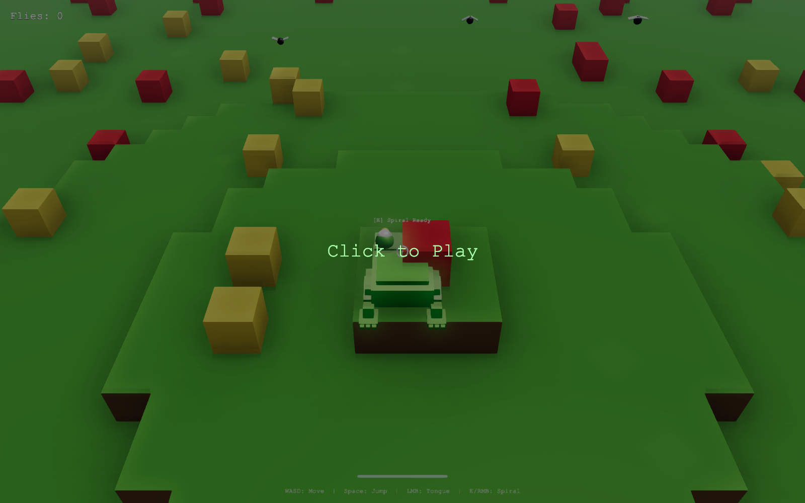
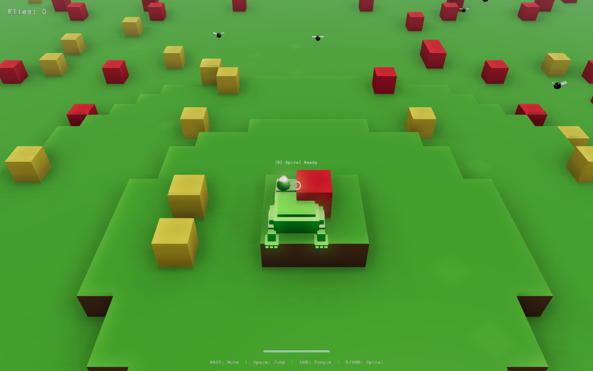
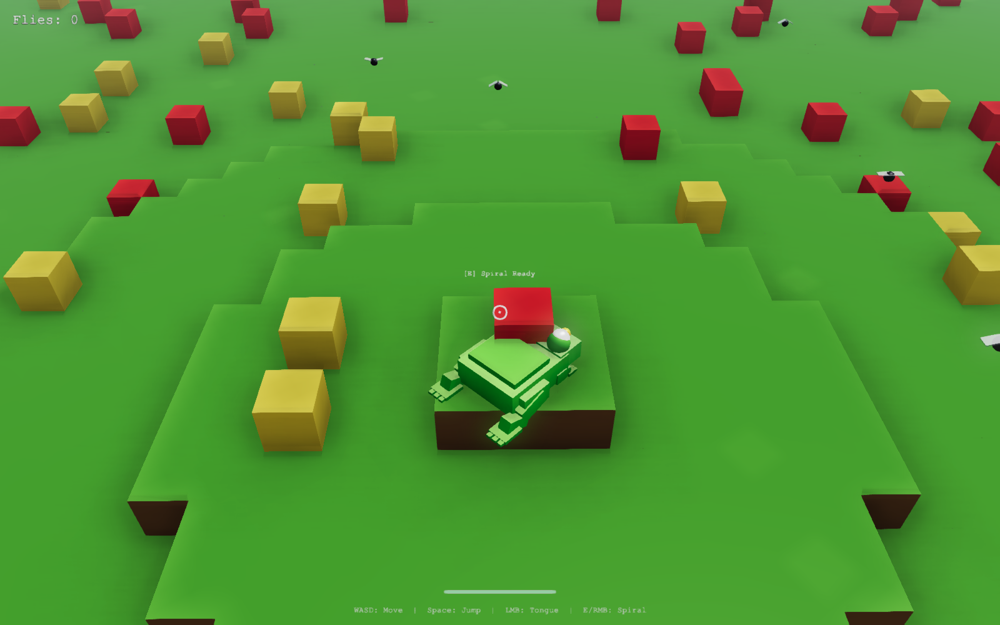

<div align="center">



# 🐸 RaNota

**Eres una rana voxel en un mundo cúbico. Salta, mira alrededor y caza moscas con la lengua.**

[](https://gavilanbe.github.io/ranota/)
&nbsp;
[](https://vitejs.dev/)
[](https://www.babylonjs.com/)
[](LICENSE)

</div>

---

## Qué es esto

RaNota es un pequeño juego 3D en el navegador montado con **Babylon.js** y **Vite**. Encarnas a una rana voxel en un mundo cúbico generado por procedimientos: un terreno verde sembrado de bloques que se renderiza en 3D real, con iluminación, audio y efectos visuales. El objetivo es sencillo y satisfactorio: moverte, saltar entre los voxels y usar la lengua para cazar las moscas que revolotean por el escenario.

El mundo se genera con ruido (noise) y las mallas se optimizan con *greedy meshing* para que el render sea ligero incluso con muchos cubos en pantalla.

## 📖 La historia

No hay villano ni final boss: hay una rana, un campo de bloques y un montón de moscas que no se dejan atrapar fácilmente. Eres tú contra tu propia puntería. Apunta, lanza la lengua, falla, vuelve a intentarlo. El placer está en el movimiento: clavar un salto sobre un cubo lejano y arrancar de un lengüetazo una mosca a media distancia.

## 🎮 Cómo se juega

| Acción | Control |
| --- | --- |
| 🖱️ Capturar el ratón / empezar | Clic en **Click to Play** |
| 👀 Mirar alrededor | Mover el ratón |
| 🚶 Moverse | `W` `A` `S` `D` |
| 🦘 Saltar | `Espacio` |
| 👅 Lengua dirigida (cazar una mosca) | Clic izquierdo |
| 🌀 Lengua en espiral (área) | `E` o clic derecho |

## 📸 Capturas

| | |
| --- | --- |
|  |  |

## ▶️ Jugar

**En línea:** [https://gavilanbe.github.io/ranota/](https://gavilanbe.github.io/ranota/)

**En local** (necesitas Node.js):

```bash
npm install
npm run dev
```

Vite abrirá el juego en tu navegador. Para generar la build de producción:

```bash
npm run build     # genera dist/
npm run preview   # sirve la build localmente
```

## 🛠️ Bajo el capó

- **[Babylon.js 7](https://www.babylonjs.com/)** (`@babylonjs/core`, `@babylonjs/gui`, `@babylonjs/materials`) — motor 3D, cámara, iluminación y GUI.
- **Mundo voxel** generado por procedimientos con **ruido (noise)** y **greedy meshing** para mallas optimizadas.
- **Física de salto** y control de cámara en primera/tercera persona con captura del puntero.
- **Mecánica de lengua** con dos modos: dirigida (raycast) y en espiral (área).
- **VFX, audio y UI** integrados desde código.
- **[Vite 6](https://vitejs.dev/)** como dev server y bundler (target `esnext`).
- Desplegado en **GitHub Pages** mediante **GitHub Actions**.

## 📦 Créditos

Hecho por [@gavilanbe](https://github.com/gavilanbe). Uno más de mi colección de juegos web hobby. 🎮

## 📄 Licencia

[MIT](LICENSE)
